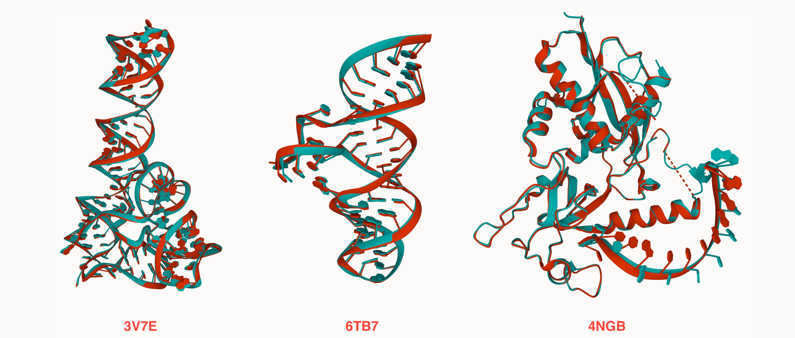

# OpenComplex
OpenComplex is an open-source platform for developing protein and RNA complex models.  
Based on DeepMind's [Alphafold 2](https://github.com/deepmind/alphafold) and AQ Laboratory's [OpenFold](https://github.com/aqlaboratory/openfold), OpenComplex support almost all features from Alphafold 2 and OpenFold, and introduces the following new features:
* Reimplemented Alphafold-Multimer models.
* RNA and protein-RNA complex models with high precision.
* Kernel fusion and optimization on >=Ampere GPUs, brings 16% 



We will release training results and pretrained parameters soon.

## Installation (Linux)

All Python dependencies are specified in `environment.yml`. For producing sequence 
alignments, you'll also need `kalign`, the [HH-suite](https://github.com/soedinglab/hh-suite), 
and one of {`jackhmmer`, [MMseqs2](https://github.com/soedinglab/mmseqs2) (nightly build)} 
installed on on your system.
Finally, some download scripts require `aria2c` and `aws`.

For convenience, we provide a script that installs Miniconda locally, creates a 
`conda` virtual environment, installs all Python dependencies, and downloads
useful resources, including both sets of model parameters. Run:

```bash
scripts/install_third_party_dependencies.sh
```

To activate the environment, run:

```bash
source scripts/activate_conda_env.sh
```

With the environment active, compile CUDA kernels with

```bash
python3 setup.py install
```

To install the HH-suite to `/usr/bin`, run

```bash
scripts/install_hh_suite.sh
```

## Usage

### Data preparation

To run feature generation pipeline from `.fasta` to `feature.pkl` on DeepMind's MSA and template database, run e.g.:
```bash
python ./scripts/extract_pkl_from_fas.py ./example_data/fasta/ ./example_data/features/
```
where `example_data` is the directory containing example fasta . If `jackhmmer`, 
`hhblits`, `hhsearch` and `kalign` are available at the default path of 
`/usr/bin`, their `binary_path` command-line arguments can be dropped.
If you've already computed alignments for the query, you have the option to 
skip the expensive alignment computation here with 
`--use_precomputed_alignments`.

### Train and Inference

See example bash scripts in example_data/scripts

## Testing

To run unit tests, use

```bash
scripts/run_unit_tests.sh
```

The script is a thin wrapper around Python's `unittest` suite, and recognizes
`unittest` arguments. E.g., to run a specific test verbosely:

```bash
scripts/run_unit_tests.sh -v tests.test_model
```

Certain tests require that AlphaFold (v2.0.1) be installed in the same Python
environment. These run components of AlphaFold and OpenFold side by side and
ensure that output activations are adequately similar. For most modules, we
target a maximum pointwise difference of `1e-4`.

## Citation

If you find our open-sourced code & models helpful to your research, please also consider star🌟 and cite📑 this repo. Thank you for your support!
```
@misc{OpenComplex_code,
  author={Jingcheng, Yu and Zhaoming, Chen and Zhaoqun, Li and Mingliang, Zeng and Wenjun, Lin and He, Huang and Qiwei, Ye},
  title={Code of OpenComplex},
  year={2022},
  howpublished = {\url{}}
}
```
It is recommended to also cite OpenFold and AlphaFold.


## License and Disclaimer

Copyright 2022 BAAI.

Extended from AlphaFold and OpenFold, OpenComplex is licensed under
the permissive Apache Licence, Version 2.0.

## Contributing

If you encounter problems using OpenComplex, feel free to create an issue! We also
welcome pull requests from the community.

